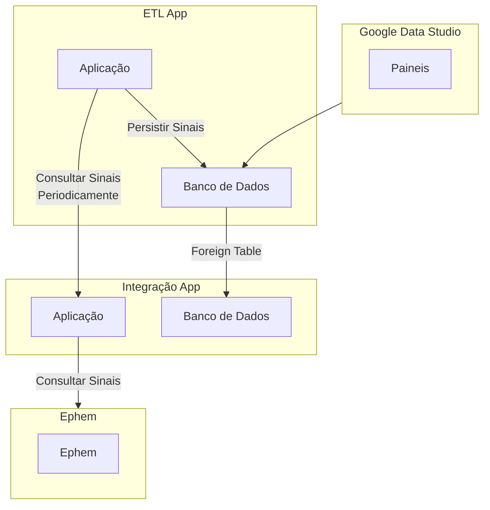

# Projeto de ETL dos Sinais do Ephem
[](https://github.com/GleytonLima/gds-ephem-etl/actions/workflows/build_and_publish.yaml) [](https://github.com/GleytonLima/gds-ephem-etl/actions/workflows/build_and_publish.yaml)

Esta aplicação age como um middleware entre o aplicativo guardiões da saúde e o ephem.



## Documentação da API

{{dominio}}/api-etl/v1/swagger-ui/#/

## Subindo a aplicação localmente
### Pré-requisitos

- Java 11
- Docker e Docker Compose Instalados na máquina

### Configurando arquivos .env

Nas pastas [docker/db](docs/docker/db) e [docker/app](docs/docker/app) há um arquivo `.env.example` Faça uma cópia dos mesmos como valor `.env` e ajuste os valores.

Acesse a [pasta docker](docs/docker) e execute o comando `docker compose up -d`.

```bash
cd docker
docker-compose -f docker-compose-with-app.yml up -d
```

A imagem do banco de dados será construida a partir do arquivo [docker/db/Dockerfile](docs/docker/db/Dockerfile) 
e a versão do app de integração será baixado do [repositório público](https://hub.docker.com/repository/docker/gleytonlima/gds-ephem-integracao/general).

Utilize a [collection do postman](docs/gds2ephem.postman_collection.json) para executar requisições na aplicação.

Acesso a página de homologação do Ephem da UNB para verificar o resultado.

## Desenvolvimento

### Configure as variáveis de ambiente

Acesse a pasta [docs/docker](docs/docker), crie uma copia do arquivo `.env.example` como `.env` e preencha os valores das variaveis de ambiente

Cadastre manualmente as variáveis de ambiente do arquivo .env na sua conta do windows.

Faça o mesmo para a pasta [docker/db](docs/docker/db). Crie o arquivo `.env` a partir do exemplo e preencha os valores.

### Suba o container docker do banco de dados em Postgres

Para subir o banco de dados localmente acesse a [pasta docker](docs/docker) e execute:

```bash
cd docs/docker
docker-compose up -d
```

Clone este projeto e abra o [Intellij IDE](https://www.jetbrains.com/idea/).
Para executar o projeto localmente, execute a classe [Application](src/main/java/br/unb/sds/gdsephemetl/Application.java).


## Foreign Table

Este projeto usa uma [foreign table](https://www.postgresql.org/docs/current/sql-createforeigntable.html) para acessar os dados do banco de dados do aplicativo de integração.

Para consultar os dados da foreign table execute o comando:

```sql
select * from gds_ephem_integracao_foreign_table;
```

A criação do foreign table é feita pelo [script](docs/docker/init-scripts/initdb.sh) que é executado quando o container do banco de dados é iniciado.

Neste caso também é necessário criar um usuário no banco de dados remoto com as permissões necessárias para acessar a foreign table.

```sql
psql -U postgres
CREATE USER <<USER>> WITH PASSWORD <<PASS>> LOGIN;

REVOKE CONNECT ON DATABASE <<DATABASE>> FROM PUBLIC;
GRANT CONNECT ON DATABASE <<DATABASE>> TO <<NOME_USUARIO>>;

ALTER USER <<USER>> CONNECTION LIMIT 10;
ALTER USER <<USER>> SET CONFIGURATION_PARAMETER_NAME = 'pg_hba.conf', 'host', '<<DATABASE>>', '<<USER>>', '<<IP>>', 'md5';

\c <<DATABASE>>

GRANT USAGE ON SCHEMA public TO <<USER>>;

GRANT SELECT ON TABLE <<TABLE>> TO etl_user;
```

## Criação de views

Para fins de exibição dos dados no Google Data Studio, podem ser criadas views no banco de dados.

```sql


CREATE OR REPLACE VIEW gds_ephem_integracao_view AS
SELECT
    gds.event_source_id AS gds_id,
	gds.signal_id AS signal_id,
	gds.user_email AS user_email,
    gds.data->>'evento_afetados' AS evento_afetados,
    gds.data->>'evento_detalhes' AS evento_detalhes,
    gds.data->>'evento_descricao' AS evento_descricao,
    gds.data->>'evento_data_ocorrencia' AS evento_data_ocorrencia,
    gds.data->>'evento_pais_ocorrencia' AS evento_pais_ocorrencia,
    gds.data->>'evento_qtde_envolvidos' AS evento_qtde_envolvidos,
    gds.data->>'evento_local_ocorrencia' AS evento_local_ocorrencia,
    gds.data->>'evento_estado_ocorrencia' AS evento_estado_ocorrencia,
    gds.data->>'evento_sabe_quando_ocorreu' AS evento_sabe_quando_ocorreu,
    gds.data->>'evento_municipio_ocorrencia' AS evento_municipio_ocorrencia,
    sinal.dados->>'signal_type' AS ephem_sinal_tipo,
	sinal.dados->'signal_stage_state_id'->>1 AS ephem_sinal_status,
	sinal.dados->'general_hazard_id'->>1 AS ephem_general_hazard,
	sinal.dados->'specific_hazard_id'->>1 AS ephem_specific_hazard,
	sinal.dados->>'confidentiality' AS ephem_confidentiality
FROM public.gds_ephem_integracao_foreign_table AS gds
LEFT JOIN sinal
ON sinal.signal_id = gds.signal_id;
```

## Exemplo de deploy na Digital Ocean

Como exemplo de deploy na Digital Ocean, para fins de testes, pode ser utilizado o repositorio [gds-ephem-etl-deploy](https://github.com/GleytonLima/gds-ephem-etl-deploy).
## Tecnologias utilizadas

- Java 11
- Spring Boot
- PostgreSQL

## Documentação da Api

Ao subir a aplicação localmente a documentação da API estará disponível em: http://localhost:8081/api-etl/v1/swagger-ui/#/
