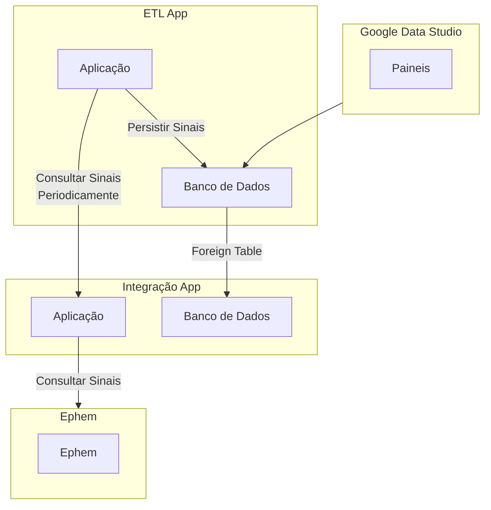

# Projeto de ETL dos Sinais do Ephem

[](https://github.com/GleytonLima/gds-ephem-etl/actions/workflows/build_and_publish.yaml) [](https://github.com/GleytonLima/gds-ephem-etl/actions/workflows/build_and_publish.yaml)

Esta aplicação age como um middleware entre o aplicativo guardiões da saúde e o ephem.



## Documentação da API

{{dominio}}/api-etl/v1/swagger-ui/#/

## Subindo a aplicação localmente

### Pré-requisitos

- Java 11
- Docker e Docker Compose Instalados na máquina

### Configurando arquivos .env

Nas pastas [docker/db](docs/docker/db) e [docker/app](docs/docker/app) há um arquivo `.env.example` Faça uma cópia dos
mesmos como valor `.env` e ajuste os valores.

Acesse a [pasta docker](docs/docker) e execute o comando `docker compose up -d`.

```bash
cd docker
docker-compose -f docker-compose-with-app.yml up -d
```

A imagem do banco de dados será construida a partir do arquivo [docker/db/Dockerfile](docs/docker/db/Dockerfile)
e a versão do app de integração será baixado
do [repositório público](https://hub.docker.com/repository/docker/gleytonlima/gds-ephem-integracao/general).

Utilize a [collection do postman](docs/gds2ephem.postman_collection.json) para executar requisições na aplicação.

Acesso a página de homologação do Ephem da UNB para verificar o resultado.

## Desenvolvimento

### Configure as variáveis de ambiente

Acesse a pasta [docs/docker](docs/docker), crie uma copia do arquivo `.env.example` como `.env` e preencha os valores
das variaveis de ambiente

Cadastre manualmente as variáveis de ambiente do arquivo .env na sua conta do windows.

Faça o mesmo para a pasta [docker/db](docs/docker/db). Crie o arquivo `.env` a partir do exemplo e preencha os valores.

### Suba o container docker do banco de dados em Postgres

Para subir o banco de dados localmente acesse a [pasta docker](docs/docker) e execute:

```bash
cd docs/docker
docker-compose up -d
```

Clone este projeto e abra o [Intellij IDE](https://www.jetbrains.com/idea/).
Para executar o projeto localmente, execute a
classe [Application](src/main/java/br/unb/sds/gdsephemetl/Application.java).

## Foreign Table

Este projeto usa uma [foreign table](https://www.postgresql.org/docs/current/sql-createforeigntable.html) para acessar
os dados do banco de dados do aplicativo de integração.

Para consultar os dados da foreign table execute o comando:

```sql
select *
from gds_ephem_integracao_foreign_table;
```

A criação do foreign table é feita pelo [script](docs/docker/init-scripts/initdb.sh) que é executado quando o container
do banco de dados é iniciado.

Neste caso também é necessário criar um usuário no banco de dados remoto com as permissões necessárias para acessar a
foreign table.

```sql
psql -U postgres
CREATE USER << USER >> WITH PASSWORD <<PASS>> LOGIN;

REVOKE CONNECT ON DATABASE << DATABASE >> FROM PUBLIC;
GRANT CONNECT ON DATABASE << DATABASE >> TO <<NOME_USUARIO>>;

ALTER
USER
<<USER>> CONNECTION LIMIT 10;
ALTER USER
<<USER>>
SET CONFIGURATION_PARAMETER_NAME = 'pg_hba.conf', 'host', '<<DATABASE>>', '<<USER>>', '<<IP>>', 'md5';

\c <<DATABASE>>

GRANT USAGE ON SCHEMA public TO << USER >>;

GRANT SELECT ON TABLE << TABLE >> TO etl_user;
```


## Criação de views

Para fins de exibição dos dados no Google Data Studio, podem ser criadas views no banco de dados.

```sql
DROP VIEW IF EXISTS gds_ephem_integracao_view;
CREATE OR REPLACE VIEW gds_ephem_integracao_view AS
SELECT gds.event_source_id                             AS gds_id,
       gds.signal_id                                   AS signal_id,
       gds.user_email                                  AS user_email,
       gds.data ->> 'evento_afetados'                  AS evento_afetados,
       gds.data ->> 'evento_detalhes'                  AS evento_detalhes,
       gds.data ->> 'evento_descricao'                 AS evento_descricao,
       gds.data ->> 'evento_data_ocorrencia'           AS evento_data_ocorrencia,
       gds.data ->> 'evento_pais_ocorrencia'           AS evento_pais_ocorrencia,
       gds.data ->> 'evento_qtde_envolvidos'           AS evento_qtde_envolvidos,
       gds.data ->> 'evento_local_ocorrencia'          AS evento_local_ocorrencia,
       gds.data ->> 'evento_estado_ocorrencia'         AS evento_estado_ocorrencia,
       gds.data ->> 'evento_sabe_quando_ocorreu'       AS evento_sabe_quando_ocorreu,
       gds.data ->> 'evento_municipio_ocorrencia'      AS evento_municipio_ocorrencia,
       sinal.dados ->> 'id'                            AS ephem_signal_id,
       sinal.dados -> 'signal_stage_state_id' ->> 1    AS ephem_sinal_status,
       sinal.dados -> 'general_hazard_id' ->> 1        AS ephem_general_hazard,
       sinal.dados -> 'specific_hazard_id' ->> 1       AS ephem_specific_hazard,
       sinal.dados ->> 'confidentiality'               AS ephem_confidentiality,
       sinal.dados ->> 'incident_date'                 AS ephem_incident_date,
       sinal.dados ->> 'name'                          AS ephem_name,
       sinal.dados ->> 'active'                        AS ephem_active,
       sinal.dados ->> 'outcome'                       AS ephem_outcome,
       sinal.dados -> 'tag_ids' ->> 1                  AS ephem_tag,
       sinal.dados -> 'state_id' ->> 1                 AS ephem_state,
       sinal.dados ->> 'was_event'                     AS ephem_was_event,
       sinal.dados -> 'country_id' ->> 1               AS ephem_country,
       sinal.dados ->> 'was_closed'                    AS ephem_was_closed,
       sinal.dados ->> 'create_date'                   AS ephem_create_date,
       sinal.dados ->> 'date_closed'                   AS ephem_date_closed,
       sinal.dados ->> 'description'                   AS ephem_description,
       sinal.dados -> 'message_ids'                    AS ephem_message_ids,
       sinal.dados ->> 'report_date'                   AS ephem_report_date,
       sinal.dados ->> 'signal_type'                   AS ephem_signal_type,
       sinal.dados -> 'aetiology_id' ->> 1             AS ephem_aetiology,
       sinal.dados ->> 'display_name'                  AS ephem_display_name,
       sinal.dados -> 'district_ids'                   AS ephem_district_ids,
       sinal.dados ->> 'verification'                  AS ephem_verification,
       sinal.dados ->> '__last_update'                 AS ephem_last_update,
       sinal.dados ->> 'verified_date'                 AS ephem_verified_date,
       sinal.dados ->> 'was_discarded'                 AS ephem_was_discarded,
       sinal.dados ->> 'was_monitored'                 AS ephem_was_monitored,
       sinal.dados ->> 'was_event_date'                AS ephem_was_event_date,
       sinal.dados ->> 'is_event_closed'               AS ephem_is_event_closed,
       sinal.dados ->> 'people_affected'               AS ephem_people_affected,
       sinal.dados ->> 'was_closed_date'               AS ephem_was_closed_date,
       sinal.dados ->> 'animals_affected'              AS ephem_animals_affected,
       sinal.dados ->> 'was_discarded_date'            AS ephem_was_discarded_date,
       sinal.dados ->> 'was_monitored_date'            AS ephem_was_monitored_date,
       sinal.dados ->> 'date_outcome_decided'          AS ephem_date_outcome_decided,
       sinal.dados -> 'verification_source_id' ->> 1   AS ephem_verification_source,
       sinal.dados ->> 'was_under_verification'        AS ephem_was_under_verification,
       sinal.dados ->> 'under_verification_date'       AS ephem_under_verification_date,
       sinal.dados -> 'outcome_justification_id' ->> 1 AS ephem_outcome_justification,
       sinal.dados ->> 'was_under_verification_date'   AS ephem_was_under_verification_date
FROM public.gds_ephem_integracao_foreign_table AS gds
         LEFT JOIN sinal
                   ON sinal.signal_id = gds.signal_id;
```

Uma view somente dos sinais:

```sql
DROP VIEW IF EXISTS sinal_view;
CREATE OR REPLACE VIEW sinal_view AS
SELECT sinal.dados ->> 'id'                            AS signal_id,
       sinal.dados -> 'signal_stage_state_id' ->> 1    AS ephem_sinal_status,
       sinal.dados -> 'general_hazard_id' ->> 1        AS ephem_general_hazard,
       sinal.dados -> 'specific_hazard_id' ->> 1       AS ephem_specific_hazard,
       sinal.dados ->> 'confidentiality'               AS ephem_confidentiality,
       sinal.dados ->> 'incident_date'                 AS ephem_incident_date,
       sinal.dados ->> 'name'                          AS ephem_name,
       sinal.dados ->> 'active'                        AS ephem_active,
       sinal.dados ->> 'outcome'                       AS ephem_outcome,
       sinal.dados -> 'tag_ids' ->> 1                  AS ephem_tag,
       sinal.dados -> 'state_id' ->> 1                 AS ephem_state,
       sinal.dados ->> 'was_event'                     AS ephem_was_event,
       sinal.dados -> 'country_id' ->> 1               AS ephem_country,
       sinal.dados ->> 'was_closed'                    AS ephem_was_closed,
       sinal.dados ->> 'create_date'                   AS ephem_create_date,
       sinal.dados ->> 'date_closed'                   AS ephem_date_closed,
       sinal.dados ->> 'description'                   AS ephem_description,
       sinal.dados -> 'message_ids'                    AS ephem_message_ids,
       sinal.dados ->> 'report_date'                   AS ephem_report_date,
       sinal.dados ->> 'signal_type'                   AS ephem_signal_type,
       sinal.dados -> 'aetiology_id' ->> 1             AS ephem_aetiology,
       sinal.dados ->> 'display_name'                  AS ephem_display_name,
       sinal.dados -> 'district_ids'                   AS ephem_district_ids,
       sinal.dados ->> 'verification'                  AS ephem_verification,
       sinal.dados ->> '__last_update'                 AS ephem_last_update,
       sinal.dados ->> 'verified_date'                 AS ephem_verified_date,
       sinal.dados ->> 'was_discarded'                 AS ephem_was_discarded,
       sinal.dados ->> 'was_monitored'                 AS ephem_was_monitored,
       sinal.dados ->> 'was_event_date'                AS ephem_was_event_date,
       sinal.dados ->> 'is_event_closed'               AS ephem_is_event_closed,
       sinal.dados ->> 'people_affected'               AS ephem_people_affected,
       sinal.dados ->> 'was_closed_date'               AS ephem_was_closed_date,
       sinal.dados ->> 'animals_affected'              AS ephem_animals_affected,
       sinal.dados ->> 'was_discarded_date'            AS ephem_was_discarded_date,
       sinal.dados ->> 'was_monitored_date'            AS ephem_was_monitored_date,
       sinal.dados ->> 'date_outcome_decided'          AS ephem_date_outcome_decided,
       sinal.dados -> 'verification_source_id' ->> 1   AS ephem_verification_source,
       sinal.dados ->> 'was_under_verification'        AS ephem_was_under_verification,
       sinal.dados ->> 'under_verification_date'       AS ephem_under_verification_date,
       sinal.dados -> 'outcome_justification_id' ->> 1 AS ephem_outcome_justification,
       sinal.dados ->> 'was_under_verification_date'   AS ephem_was_under_verification_date
FROM sinal;
```

Uma view para as ações tomadas:

```sql
DROP VIEW IF EXISTS acao_tomada_view;
CREATE OR REPLACE VIEW acao_tomada_view AS
SELECT dados ->> 'id'                      AS id,
       (dados ->> 'name')::boolean         AS name,
       (dados -> 'signal_id')::jsonb -> 0  AS signal_id,
       dados ->> 'start_date'              AS start_date,
       dados -> 'action_type' ->> 1        AS action_type,
       dados ->> 'create_date'             AS create_date,
       dados ->> 'action_level'            AS action_level,
       dados ->> '__last_update'           AS __last_update,
       dados ->> 'action_status'           AS action_status,
       dados ->> 'complete_date'           AS complete_date,
       dados ->> 'action_details'          AS action_details,
       dados -> 'action_focal_point' ->> 1 AS action_focal_point
FROM acao_tomada;
```

Uma view para as fontes:

```sql
DROP VIEW IF EXISTS fonte_view;
CREATE OR REPLACE VIEW fonte_view AS
SELECT dados ->> 'id'                     AS id,
       dados ->> 'name'                   AS name,
       (dados -> 'signal_id')::jsonb -> 0 AS signal_id,
       dados ->> 'create_date'            AS create_date,
       dados ->> 'source_name'            AS source_name,
       dados -> 'source_type' ->> 1       AS source_type,
       dados ->> 'display_name'           AS display_name,
       dados ->> '__last_update'          AS __last_update,
       dados ->> 'source_address'         AS source_address
FROM fonte;
```

Uma view para as recomendações técnicas:

```sql
DROP VIEW IF EXISTS recomendacao_tecnica_view;
CREATE OR REPLACE VIEW recomendacao_tecnica_view AS
SELECT dados ->> 'id'                                       AS id,
       (dados ->> 'name')::boolean                          AS name,
       (dados ->> 'note')::text                             AS note,
       dados -> 'signal_id' -> 0                            AS signal_id,
       dados ->> 'create_date'                              AS create_date,
       dados ->> 'display_name'                             AS display_name,
       dados ->> '__last_update'                            AS __last_update,
       dados -> 'justification' ->> 1                       AS justification,
       dados -> 'recommended_action' ->> 1                  AS recommended_action,
       dados ->> 'recommendation_date'                      AS recommendation_date,
       (dados ->> 'recommendation_pending_review')::boolean AS recommendation_pending_review
FROM recomendacao_tecnica;
```

## Views Mais específicas

Tem médio em dias para conclusão das ações tomadas:

```sql
DROP VIEW IF EXISTS average_time_to_complete_actions_view;
CREATE OR REPLACE VIEW average_time_to_complete_actions_view AS
SELECT action_type                                                                             AS action_type,
       AVG(EXTRACT(EPOCH FROM (start_date::timestamp - complete_date::timestamp))) / 3600 / 24 AS avg_days_to_complete
FROM acao_tomada_view
WHERE action_status = 'completed'
GROUP BY action_type;
```

Quantidade de alertas positivos (eventos) (#8):

```sql
DROP VIEW IF EXISTS alertas_positivos_view;
CREATE OR REPLACE VIEW alertas_positivos_view AS
SELECT DATE_TRUNC('month', ephem_was_event_date::timestamp)                                                   AS month,
       SUM(CASE
               WHEN ephem_was_monitored = 'true' OR ephem_was_under_verification = 'true' THEN 1
               ELSE 0 END)                                                                                    AS total_verification_or_monitored,
       SUM(CASE WHEN ephem_was_event = 'true' THEN 1 ELSE 0 END)                                              AS total_event,
       (SUM(CASE WHEN ephem_was_monitored = 'true' OR ephem_was_under_verification = 'true' THEN 1 ELSE 0 END) *
        100.0) /
       NULLIF(SUM(CASE WHEN ephem_was_event = 'true' THEN 1 ELSE 0 END), 0)                                   AS percent_verification_or_monitored_by_event
FROM sinal_view
WHERE ephem_was_event = 'true'
group by month;
```

Quantidade de alertas verificados (#9):

```sql
DROP VIEW IF EXISTS alertas_confirmados_view;
CREATE OR REPLACE VIEW alertas_confirmados_view AS
SELECT DATE_TRUNC('month', ephem_report_date::timestamp)                     AS month,
       SUM(CASE WHEN ephem_verification = 'verified' THEN 1 ELSE 0 END)      AS total_verified,
       SUM(CASE WHEN ephem_report_date NOTNULL THEN 1 ELSE 0 END)            AS total_reported,
       (SUM(CASE WHEN ephem_verification = 'verified' THEN 1 ELSE 0 END) * 100.0) /
       NULLIF(SUM(CASE WHEN ephem_report_date NOTNULL THEN 1 ELSE 0 END), 0) AS percent_verified
FROM sinal_view
group by month;
```

Oportunidade Média de Detecção (#11):

```sql
DROP VIEW IF EXISTS alertas_delay_view;
CREATE OR REPLACE VIEW alertas_delay_view AS
SELECT DATE_TRUNC('month', ephem_report_date::timestamp)                  AS month,
       AVG(ephem_report_date::timestamp - ephem_incident_date::timestamp) AS report_delay
FROM sinal_view
group by month;
```

Quantidade de alertas por localizacao (#27 e #28)

```sql
DROP VIEW IF EXISTS alertas_por_local_view;
CREATE OR REPLACE VIEW alertas_por_local_view AS
SELECT evento_pais_ocorrencia, evento_estado_ocorrencia, evento_municipio_ocorrencia, evento_local_ocorrencia, DATE_TRUNC('month', ephem_report_date::timestamp) AS evento_mes, count(*)
FROM gds_ephem_integracao_view
GROUP BY evento_pais_ocorrencia, evento_estado_ocorrencia, evento_municipio_ocorrencia, evento_local_ocorrencia, evento_mes
ORDER BY evento_mes DESC;
```

Quantidade de ações tomadas por tipo e mês (#29):

```sql
DROP VIEW IF EXISTS total_acoes_por_tipo_view;
CREATE OR REPLACE VIEW total_acoes_por_tipo_view AS
SELECT action_type,
       DATE_TRUNC('month', create_date::timestamp) AS month,
       COUNT(*)                                    AS total_actions
FROM acao_tomada_view
GROUP BY month, action_type;
```

## Exemplo de deploy na Digital Ocean

Como exemplo de deploy na Digital Ocean, para fins de testes, pode ser utilizado o
repositorio [gds-ephem-etl-deploy](https://github.com/GleytonLima/gds-ephem-etl-deploy).

## Tecnologias utilizadas

- Java 11
- Spring Boot
- PostgreSQL

## Documentação da Api

Ao subir a aplicação localmente a documentação da API estará disponível
em: http://localhost:8081/api-etl/v1/swagger-ui/#/
